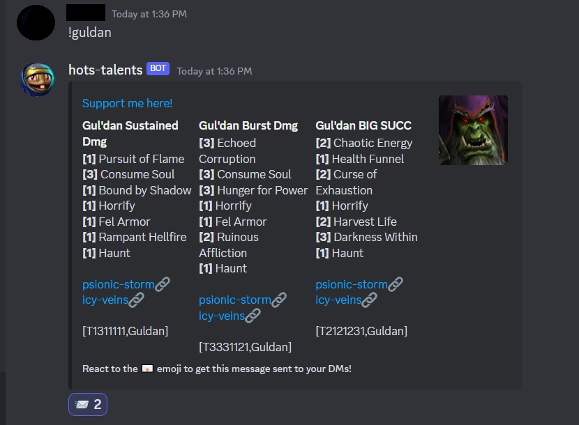

This Discord bot reacts to messages of the form "!%hero%" by printing the hero's recommended build. The builds are sourced from FanHots' public Google Sheet. 
Example prompt: 
```shell
!valla
```

To add the bot use this [link](https://discord.com/api/oauth2/authorize?client_id=1189981976841699411&permissions=2048&scope=bot)



Quick dive into go language.
The goal was to build fully working imlementation in under 4 hours.

Would be interestinng to:
 - fetch github consts and meta async (goroutines) 
 - fetch google resources async in relation to github 